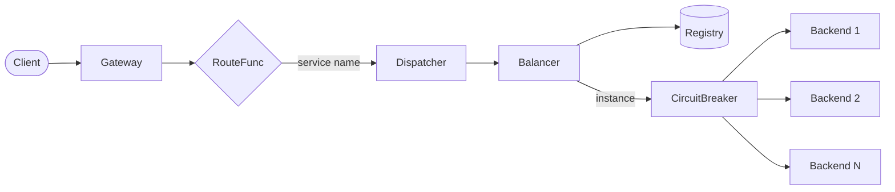
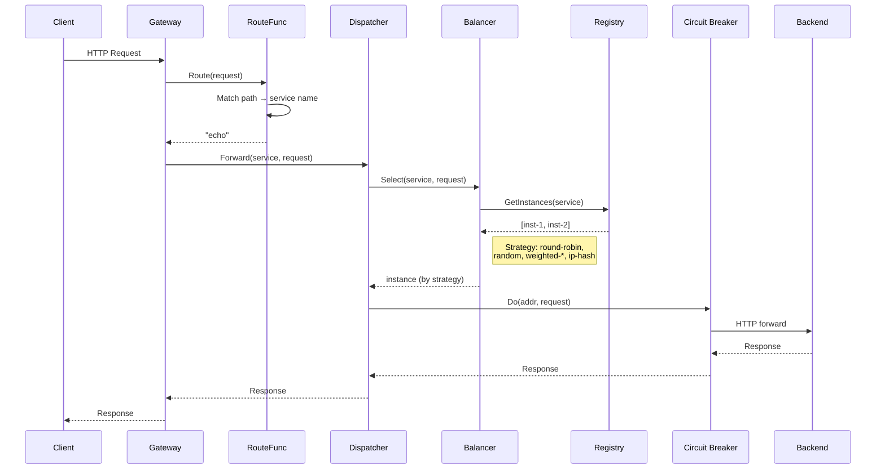
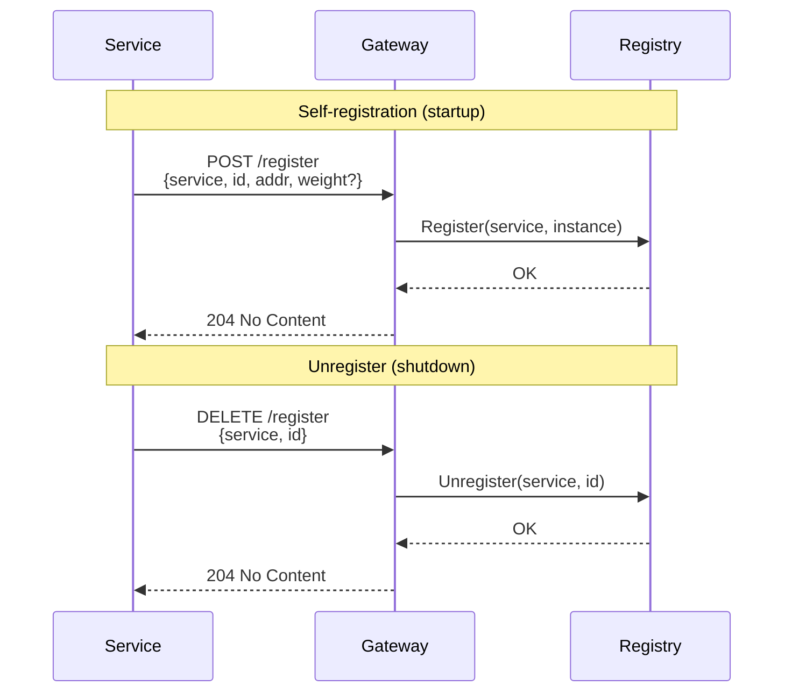
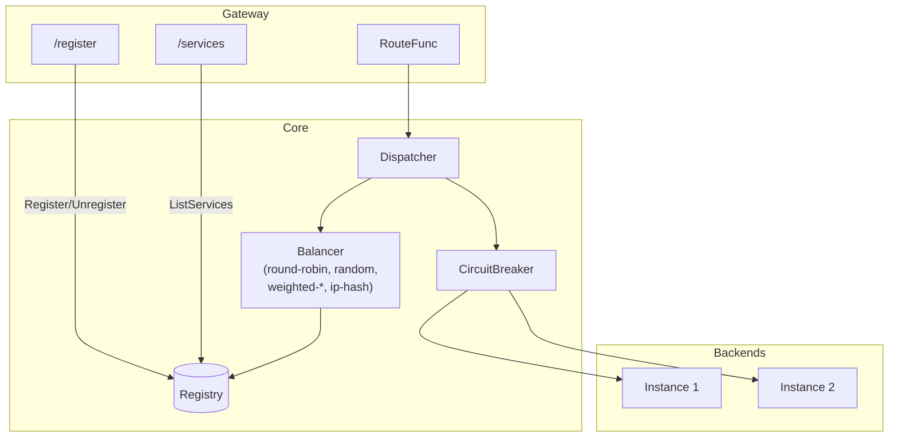
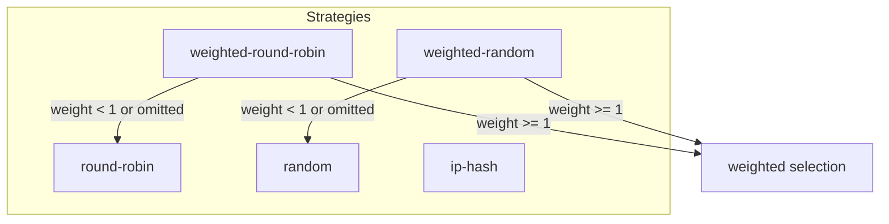

# Kerberos

A Go gateway with service registry, load balancer, and circuit breaker. Receives HTTP requests and dispatches them to backend services.

## Architecture



## Request Flow



## Registration Flow



## Component Overview



## Features

- **Service Registry** – In-memory registry for services and instances
- **HTTP Registration API** – Self-register via POST/DELETE `/register`
- **Load Balancer** – Multiple strategies: round-robin, random, weighted-round-robin, weighted-random, ip-hash
- **Circuit Breaker** – Per-backend circuit breaker to prevent cascading failures
- **HTTP Gateway** – Single entry point that routes by path prefix

## Project Structure

```
kerberos/
├── main.go                 # Entry point, wiring
├── internal/
│   ├── registry/           # Service registry
│   ├── balancer/           # Load balancer (round-robin)
│   ├── circuitbreaker/     # Circuit breaker wrapper
│   ├── dispatcher/         # Request forwarding
│   └── gateway/            # HTTP server
└── README.md
```

## Load Balancing



| Strategy | Env Var | Description |
|----------|---------|-------------|
| `round-robin` | (default) | Cycles through instances sequentially |
| `random` | `BALANCER_STRATEGY=random` | Picks a random instance each time |
| `weighted-round-robin` | `BALANCER_STRATEGY=weighted-round-robin` | Round-robin proportional to weight. If weight &lt; 1 or omitted, falls back to round-robin |
| `weighted-random` | `BALANCER_STRATEGY=weighted-random` | Random selection proportional to weight. If weight &lt; 1 or omitted, falls back to random |
| `ip-hash` | `BALANCER_STRATEGY=ip-hash` | Same client IP → same instance (session affinity) |

Weights are set at registration. Example: `{"service":"echo","id":"inst-1","addr":"http://localhost:8081","weight":3}`. Weight ≥ 1 enables weighted strategies; weight &lt; 1 or omitted uses the unweighted variant.

## Usage

### Run the gateway

```bash
go run .
# Or with a different load balancing strategy:
BALANCER_STRATEGY=ip-hash go run .
```

The gateway listens on `:8080`. Routes are configured in `main.go` – by default, `/echo/*` is routed to the `echo` service.

### Register services

**Option 1: HTTP API (self-registration)**

```bash
# Register an instance (optional: add "weight": 3 for weighted strategies)
curl -X POST http://localhost:8080/register \
  -H "Content-Type: application/json" \
  -d '{"service":"echo","id":"inst-1","addr":"http://localhost:8081","weight":2}'

# Unregister an instance
curl -X DELETE http://localhost:8080/register \
  -H "Content-Type: application/json" \
  -d '{"service":"echo","id":"inst-1"}'

# List registered services
curl http://localhost:8080/services
```

**Option 2: Programmatic (in `main.go`)**

```go
reg.Register("myservice", registry.Instance{ID: "inst-1", Addr: "http://localhost:9001"})
reg.Register("myservice", registry.Instance{ID: "inst-2", Addr: "http://localhost:9002", Weight: 2})
```

### Routing

Implement a `RouteFunc` that maps requests to service names. Example (path prefix):

```go
route := func(r *http.Request) string {
    if strings.HasPrefix(r.URL.Path, "/api/users") {
        return "users-service"
    }
    if strings.HasPrefix(r.URL.Path, "/api/orders") {
        return "orders-service"
    }
    return ""
}
```

## Try it

1. Start a simple echo server on 8081 and 8082 (e.g. `python -m http.server 8081`)
2. Run the gateway: `go run .`
3. `curl http://localhost:8080/echo/` – requests will be load-balanced across backends

## Circuit Breaker

Each backend has its own circuit breaker. After 5 consecutive failures, the circuit opens and requests fail fast. After 30 seconds, it moves to half-open and allows a few probe requests.
